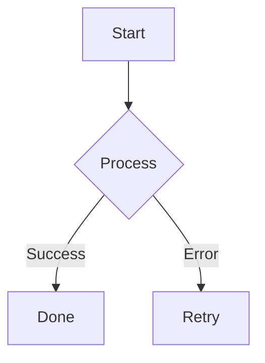

<div align="center">
  
  <h1>Tech Talks</h1>
</div>

---

### Available Presentations

| # | Topic | Link |
|:---:|:---|:---:|
| 1 | **Java 11 ➡ 17** | [View Presentation](https://reflexdemon.github.io/tech-talks/?presentation=java-11-to-17) |
| 2 | **OpenSpec (WIP)** | [View Presentation](https://reflexdemon.github.io/tech-talks/?presentation=openspec) |

---

## 🛠️ User Guide: Adding/Modifying Presentations

Follow these steps to create or update a presentation.

### 1. Configure the Presentation
Open [presentations/config.json](presentations/config.json) and add an entry for your presentation ID. This ID will be used in the URL: `?presentation=your-id`.

```json
"my-talk": {
  "theme": "black",
  "slides": [
    {
      "file": "intro.md",
      "bg": "/images/background-1.jpg",
      "bgSize": "cover"
    }
  ]
}
```

*   **`theme`**: Reveal.js theme name (e.g., `black`, `white`, `beige`, `league`).
*   **`file`**: The markdown file located in `presentations/your-id/`.
*   **`bg`**: Background image path (relative to `site/`, usually starts with `/images/`).
*   **`bgSize`**: CSS background-size (e.g., `cover`, `contain`).

### 2. Slide Syntax & Examples

Create your markdown files in `presentations/<presentation-id>/`. Use the following separators:
*   `>>` : **Horizontal Slide** (Moves left/right)
*   `VV` : **Vertical Slide** (Moves up/down within a section)

#### 🔹 Simple Title Slide
```markdown
## Presentation Title
Subtitle or description here
```

#### 🔹 Slides with Bullets & Fragments
Use fragments to make items appear one by one.
```markdown
## Key Features
* Item 1 <!-- .element: class="fragment" -->
* Item 2 <!-- .element: class="fragment" -->
* Item 3 <!-- .element: class="fragment" -->
```

#### 🔹 Slide with Custom Image
Place images in `assets/images/`. They are copied to `site/images/` during build.
```markdown
## Architecture Overview

```

#### 🔹 Slide with Mermaid Diagram
Render live diagrams using Mermaid syntax.


#### 🔹 Slide with jsMind (Mind Maps)
Use the `jsmind` code fence with a JSON node tree.
```jsmind
{
  "meta": { "name": "demo", "version": "0.2" },
  "format": "node_tree",
  "data": {
    "id": "root", "topic": "Tech Stack", "children": [
      { "id": "s1", "topic": "Frontend" },
      { "id": "s2", "topic": "Backend" }
    ]
  }
}
```

---

### 🚀 Advanced Capabilities

#### 🎤 Speaker Notes
Add `Note:` at the bottom of any slide to add cues for yourself. Press **'S'** during the presentation to open the Speaker View.
```markdown
## Secret Details
Only you see these notes.

Note: Mention the performance benchmarks and future roadmap here.
```

#### 🔦 Spotlight
Highlight specific parts of your slides during a talk.
*   **Toggle**: Press **'Ctrl'** or **'Meta'** (Command) and move the mouse.
*   **Persistent**: Left-click while spotlight is active to "pin" it.

#### 🔢 Code Line Highlighting
Highlight specific lines in code blocks using `[]` after the language name.
```java [1|3-5]
public class Demo {
    public void start() {
        // This will be highlighted on the second step
        System.out.println("Highlighted line");
    }
}
```

#### 🛠️ Local Development
1. Install dependencies: `npm install`
2. Start dev server: `npm start`
3. Visit: `http://localhost:8000/?presentation=your-id`

---

<div align="center">
  <p><i>Please scan the QR code below to access all tech talks on your mobile device.</i></p>
  
</div>

<br/>

<div align="center">
  <a href="https://reflexdemon.github.io/tech-talks/">
    
  </a>
</div>