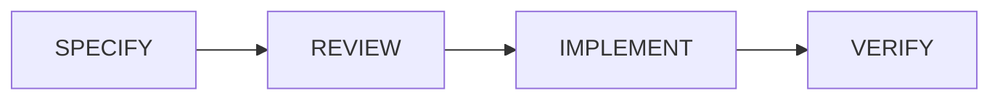

## What is Spec-Driven Development (SDD)?
Spec-Driven Development (SDD) is a software engineering methodology where the development process is strictly guided by writing detailed specifications before any actual code is written.

VV
## SDD Workflow

* **Define the Spec** <!-- .element: class="fragment" -->
* **Review and Agree** <!-- .element: class="fragment" -->
* **Generate/Implement** <!-- .element: class="fragment" -->
* **Verify** <!-- .element: class="fragment" -->

Note:
* Define the Spec: The developer writes a specification for a new feature (e.g., defining API endpoints, data models, and business logic requirements).
* Review and Agree: Teams (or the human/AI pair) review the spec to ensure edge cases are handled and architecture is sound before the expensive part (coding) begins.
* Generate/Implement: Code is written to strictly satisfy the spec. In tools like OpenSpec, the AI assistant reads the spec artifact and generates the implementation code based on those exact constraints.
* Verify: Tests are run to ensure the resulting code directly matches what the specification demanded.

VV

## AI-Driven Spec Development
- Predictable AI Behavior <!-- .element: class="fragment" -->
- Reduced "vibe coding" errors <!-- .element: class="fragment" -->
- Build your own knowledgebase <!-- .element: class="fragment" -->

<blockquote class="fragment">
    

        Automate implementation, testing, and validation, thereby reducing ambiguity and preventing architectural drift in AI-generated code
    

</blockquote>

Note:
1. The Spec acts as knowledge base for the AI assistant.
2. Code is generated based on the spec. Thus reduces errors.
3. Over the time this knowledgebase grows and helps the AI assistant to generate better code.