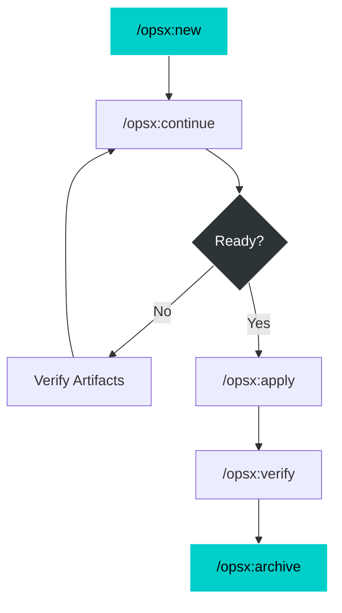
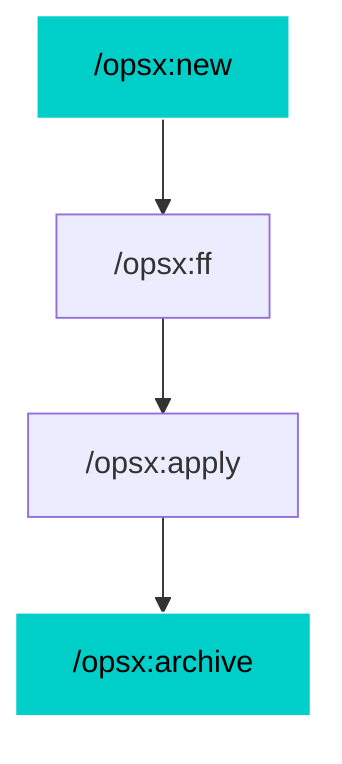
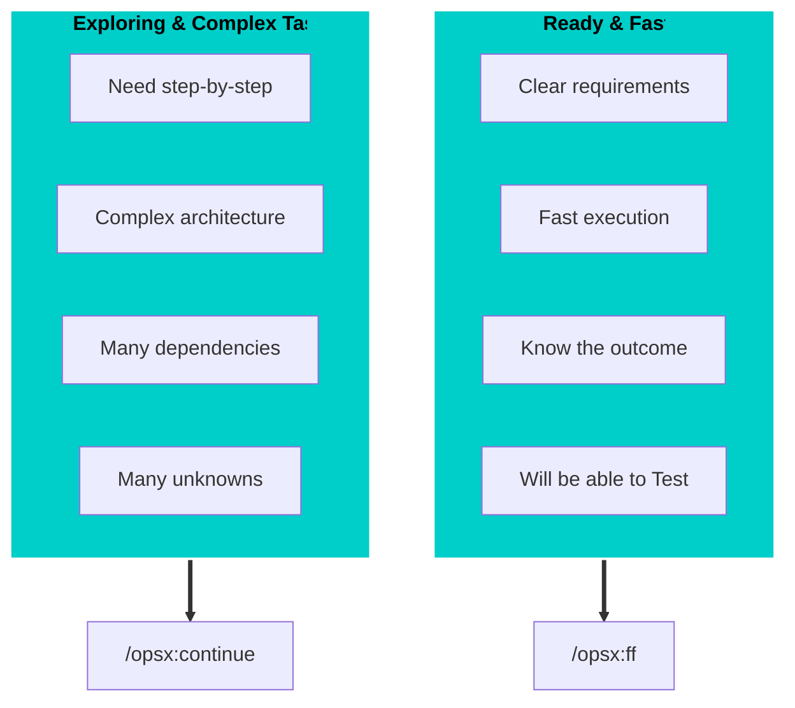

<h3 style="font-family: 'Silkscreen', 'Chakra Petch', sans-serif; font-size: 2.5em; letter-spacing: 5px; text-transform: uppercase; color: #fff;">OPENSPEC</h3>
<h4 style="font-family: 'VT323', monospace; letter-spacing: 2px; text-transform: uppercase;">A Lightweight Framework <br>for Spec-driven Development</h4>

>>
## How does <span style="font-family: 'Silkscreen', 'Chakra Petch', sans-serif; font-size: .89em; letter-spacing: 0px; text-transform: uppercase; color: #fff;">OPENSPEC</span> help in SDD?
- **Artifact-Driven** <!-- .element: class="fragment" -->
    * Proposals, Designs, Specs, Tasks
- **Predictability** <!-- .element: class="fragment" -->
    * Structured workflow ensures high-quality output
- **Context Awareness** <!-- .element: class="fragment" -->
    * Connects existing project context with new requirements


VV


## What does this mean?
<div style="text-align: left; font-size: 0.8em; line-height: 1.5;">
<strong>Classic Software Development:</strong><br>
<code style="background: rgba(255,100,100,0.1); color: #ff7675;" class="fragment">PLANNING ──► IMPLEMENTING ──► DONE</code><br><br>

<strong><span style="font-family: 'Silkscreen', 'Chakra Petch', sans-serif; font-size: .89em; letter-spacing: 0px; text-transform: uppercase; color: #fff;">OPENSPEC</span> method:</strong><br>
<code style="background: rgba(51,153,255,0.1); color: #3399ff;" class="fragment">proposal ──► specs ──► design ──► tasks ──► implement</code>
</div>

Note:
Classic workflows force you through strict phases. You can't go back! 
OpenSpec uses fluid actions where dependencies are enablers showing what's possible, not strictly what's required next. You can jump back to specs during implementation!


VV
VV

## The Artifacts
- Proposal (`proposal.md`) <!-- .element: class="fragment" -->
    - High-level overview
    - Context
    - Dependencies
- Specs (`specs/*.md`) <!-- .element: class="fragment" -->
    - Detailed technical specifications
    - Implementation details
    - Dependencies
- Design (`design.md`) <!-- .element: class="fragment" -->
    - High-level architecture
    - Component design
    - Dependencies
- Tasks (`tasks.md`) <!-- .element: class="fragment" -->
    - Implementation tasks
    - Dependencies

>>

## Traditional Operating Mode

- **Path:** <!-- .element: class="fragment" -->
  `/opsx:new ──► /opsx:continue ──► ... ──► /opsx:apply ──► /opsx:verify ──► /opsx:archive`


VV
## Quick Operating Mode
- **Path:** <!-- .element: class="fragment" -->
  `/opsx:new ──► /opsx:ff ──► /opsx:apply ──► /opsx:archive`


VV


### Example: Quick Feature (Expanded)
<div class="chat-window" style="font-size: 0.5em;">
    <div class="chat-msg msg-user fragment" data-fragment-index="1">/opsx:new add-logout-button 👤</div><div class="clearfix"></div>
    <div class="chat-msg msg-ai fragment" data-fragment-index="2">🤖 Created openspec/changes/add-logout-button/<br/>Ready to create: proposal</div><div class="clearfix"></div>
    <div class="chat-msg msg-user fragment" data-fragment-index="3">/opsx:ff 👤</div><div class="clearfix"></div>
    <div class="chat-msg msg-ai fragment" data-fragment-index="4">🤖 Creating all planning artifacts...<br/>✓ proposal.md ✓ specs/ ✓ design.md ✓ tasks.md<br/>Ready for implementation!</div><div class="clearfix"></div>
    <div class="chat-msg msg-user fragment" data-fragment-index="5">/opsx:apply 👤</div><div class="clearfix"></div>
    <div class="chat-msg msg-ai fragment" data-fragment-index="6">🤖 Working through tasks...<br/>✓ All tasks complete!</div><div class="clearfix"></div>
    <div class="chat-msg msg-user fragment" data-fragment-index="7">/opsx:archive 👤</div><div class="clearfix"></div>
    <div class="chat-msg msg-ai fragment" data-fragment-index="8">🤖 ✓ Merged specs & Archived change</div><div class="clearfix"></div>
</div>

Note: 
If you know exactly what you want to build, jump immediately to the FF command to skip incremental planning, then apply and archive.


VV
## When to Use What



<div class="tip-banner fragment fade-in">
<strong>💡 Tip:</strong>
    <ul>
    <li>
        Wish to describe the full scope upfront? → Use <strong>QUICK MODE</strong>
    </li>
    <li>
        Figuring it out? → Use <strong>TRADITIONAL MODE</strong>
    </li>
    </ul>
</div>


>>
## The Exploratory Path
When requirements are unclear:

`/opsx:explore ──► /opsx:new ──► /opsx:continue`

VV
### Example: Exploration
<div class="chat-window" style="font-size: 0.5em;">
    <div class="chat-msg msg-user fragment" data-fragment-index="1">/opsx:explore 👤</div><div class="clearfix"></div>
    <div class="chat-msg msg-ai fragment" data-fragment-index="2">🤖 What would you like to explore?</div><div class="clearfix"></div>
    <div class="chat-msg msg-user fragment" data-fragment-index="3">Improve page load performance. Not sure where bottlenecks are👤</div><div class="clearfix"></div>
    <div class="chat-msg msg-ai fragment" data-fragment-index="4">🤖 [Analyzes codebase...]<br/>Found 3 bottlenecks. Which to tackle? Data fetching?</div><div class="clearfix"></div>
    <div class="chat-msg msg-user fragment" data-fragment-index="5">/opsx:new optimize-fetching 👤</div><div class="clearfix"></div>
    <div class="chat-msg msg-ai fragment" data-fragment-index="6">🤖 Created change. Ready to create proposal.</div><div class="clearfix"></div>
    <div class="chat-msg msg-user fragment" data-fragment-index="7">/opsx:continue 👤</div><div class="clearfix"></div>
    <div class="chat-msg msg-ai fragment" data-fragment-index="8">🤖 Creating proposal based on our exploration...</div><div class="clearfix"></div>
</div>

Note:
This is perfect for debugging, architectural decisions, and situations where you don't fully know what code must change yet.

>>
## Parallel Changes
Work on multiple features/fixes at once!

```text [1|1,5|1,3,5]
Change A: /opsx:new ──► /opsx:apply (in progress)
                         │
                    context switch
                         │
Bug Fix B: /opsx:new ──► /opsx:apply ──► /opsx:archive
```

VV


### Example: Interruptions Handled
<div class="chat-window" style="font-size: 0.5em;">
    <div class="chat-msg msg-user fragment" data-fragment-index="1">I'm working on dark mode but got pulled into a bug fix. 👤<br/>/opsx:new fix-login-redirect</div><div class="clearfix"></div>
    <div class="chat-msg msg-ai fragment" data-fragment-index="2">🤖 Created openspec/changes/fix-login-redirect/</div><div class="clearfix"></div>
    <div class="chat-msg msg-user fragment" data-fragment-index="3">/opsx:apply 👤</div><div class="clearfix"></div>
    <div class="chat-msg msg-ai fragment" data-fragment-index="4">🤖 Implementing fix... All tasks complete!</div><div class="clearfix"></div>
    <div class="chat-msg msg-user fragment" data-fragment-index="5">/opsx:archive 👤</div><div class="clearfix"></div>
    <div class="chat-msg msg-ai fragment" data-fragment-index="6">🤖 ✓ Archived fix-login-redirect</div><div class="clearfix"></div>
    <div class="chat-msg msg-user fragment" data-fragment-index="7">/opsx:apply add-dark-mode 👤</div><div class="clearfix"></div>
    <div class="chat-msg msg-ai fragment" data-fragment-index="8">🤖 Resuming add-dark-mode... Picking up at task 2.3</div><div class="clearfix"></div>
</div>

Note:
Need to jump off a long feature to do a quick bug fix? OpenSpec changes are perfectly isolated. Just open a new change, fix the bug, archive it, and resume your feature right where you left off.

>>
## Completing a Change
Secure, safe, and synced.

`/opsx:apply ──► /opsx:verify ──► /opsx:archive`

Note:
Completing an expanded change gives you the opportunity to deeply verify the code before permanently syncing specs.

VV

### Verify: Check Your Work
Checks Completeness, Correctness, and Coherence.

<div class="chat-window" style="font-size: 0.5em;">
    <div class="chat-msg msg-user fragment" data-fragment-index="1">/opsx:verify 👤</div><div class="clearfix"></div>
    <div class="chat-msg msg-ai fragment" data-fragment-index="2">🤖 Verifying add-auth...<br/><br/>COMPLETENESS<br/>✓ All 12 tasks complete.<br/>⚠ Scenario "Session timeout" not tested.<br/><br/>CORRECTNESS<br/>✓ Implementation matches spec intent.<br/><br/>COHERENCE<br/>⚠ Design mentions "events", but code uses polling.</div><div class="clearfix"></div>
    <div class="chat-msg msg-user fragment" data-fragment-index="3">Will update the tests and refactor to events. Thanks! 👤</div><div class="clearfix"></div>
</div>

Note:
Verify won't block archive, but it surfaces issues you might want to address first!

VV

### Archive: Finish Strong
Merge changes to the source of truth!

<div class="chat-window" style="font-size: 0.5em;">
    <div class="chat-msg msg-user fragment" data-fragment-index="1">/opsx:archive 👤</div><div class="clearfix"></div>
    <div class="chat-msg msg-ai fragment" data-fragment-index="2">🤖 Archiving add-auth...<br/><br/>Artifact status:<br/>✓ Checked across all tasks.<br/><br/>Delta specs: Not yet synced.<br/>→ Would you like to sync now?</div><div class="clearfix"></div>
    <div class="chat-msg msg-user fragment" data-fragment-index="3">Yes 👤</div><div class="clearfix"></div>
    <div class="chat-msg msg-ai fragment" data-fragment-index="4">🤖 ✓ Synced specs to openspec/specs/auth/spec.md<br/>✓ Moved to archive/2026-xxx-add-auth/</div><div class="clearfix"></div>
</div>

Note:
Archive completes the lifecycle, moving localized delta specs back up to the global specification library.


>>

## Live Demo!

Using <span style="font-family: 'Silkscreen', 'Chakra Petch', sans-serif; font-size: 1em; letter-spacing: 1px; text-transform: uppercase; color: #fff;">OPENSPEC</span> to make a small change in the codebase.