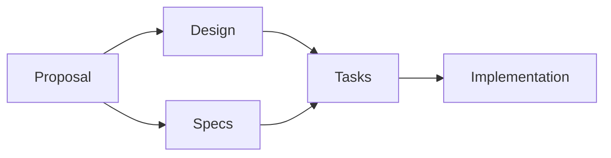

## Spec-Driven Development
 using OpenSpec
#### Review intent, not just code


Venkateswara VP
<br/>
🅧 @reflexdemon

>>
## Agenda
* What is Spec-driven development (SDD)?
* How OpenSpec helps?
* Lets get started with OpenSpec
* Demo App Building
* Q&A

VV
## The "Vibe Coding" Reality


VV

### Pitfalls:
* **Inconsistency**: Output varies wildly between prompts.
* **Lack of Maintainability**: Logic is hidden in chat history.
* **Hidden Debt**: "Black box" code generation leads to bugs.

>>
## Why SDD?
- **Executable Source of Truth** <!-- .element: class="fragment" -->
    * Machine-readable specs (Markdown, OpenAPI).
- **Predictable AI Behavior** <!-- .element: class="fragment" -->
    * AI agents follow a verified plan.
- **Improved Collaboration** <!-- .element: class="fragment" -->
    * Human-to-Human and Human-to-AI.

VV
## SDD Levels


>>
## How OpenSpec Helps
- **Artifact-Driven** <!-- .element: class="fragment" -->
    * Proposals, Designs, Specs, Tasks.
- **Predictability** <!-- .element: class="fragment" -->
    * Structured workflow ensures high-quality output.
- **Context Awareness** <!-- .element: class="fragment" -->
    * Connects existing project context with new requirements.

VV
## The Artifact Chain


>>
## OpenSpec Workflow in Action
### 1. Proposal & Design
Review the *intent* of the change before any code is written.

VV
### 2. Specifications & Scenarios
Define requirements using Gherkin-style scenarios (GIVEN/WHEN/THEN).
```markdown
#### Scenario: Java Boilerplate reduction
- **GIVEN** a Plain Old Java Object (POJO)
- **WHEN** applying the Spec-Driven approach
- **THEN** generate immutable Records with zero manual code.
```

VV
### 3. Implementation & Verification
Agents execute tasks based on specs, and the CLI verifies the output.

>>
## Developer's Delight


VV
## Benefits
- **Reduced Hallucinations**: Code matches the Spec exactly.
- **Test Generation**: Specs automatically drive Unit & Integration tests.

>>
## Call to Action
* **Start Small**: Use OpenSpec for your next bug fix.
* **Focus on Intent**: Spend more time on Specs, less on Vibe prompts.
* **Collaborate**: Share specs with your team and your AI.

>>

## Q&A
### Thank You!
🅧 @reflexdemon
