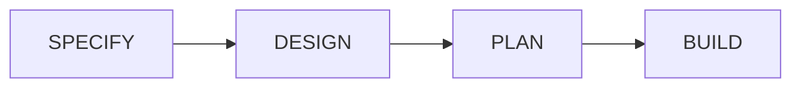
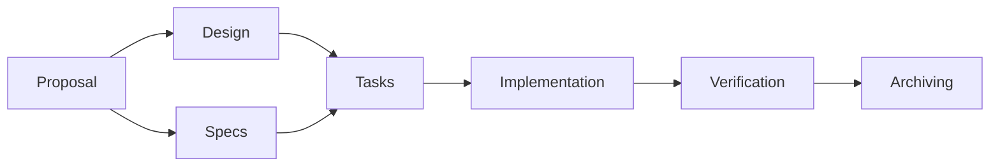

<h1 style="font-family: 'Silkscreen', 'Chakra Petch', sans-serif; font-size: 2.5em; letter-spacing: 5px; text-transform: uppercase; color: #fff;">OPENSPEC</h1>
<h3 style="font-family: 'VT323', monospace; letter-spacing: 2px; text-transform: uppercase;">A Lightweight Framework <br>for Spec-driven Development</h3>


Venkateswara VP
<br/>
🅧 @reflexdemon

>>
## Agenda
* What is Spec-driven development (SDD)?
* How OpenSpec helps?
* Lets get started with OpenSpec
* Demo App Building
* Q&A

VV
## The "Vibe Coding" Reality


Note: How many of you vibe code?

VV

### Pitfalls
* **Inconsistency** <!-- .element: class="fragment" -->
    - Output varies wildly between prompts.
* **Lack of Maintainability** <!-- .element: class="fragment" -->
    - Logic is hidden in chat history.
* **Hidden Debt** <!-- .element: class="fragment" -->
    - "Black box" code generation leads to bugs.

>>
## What is Spec-Driven Development (SDD)?
SDD is about front-loading the thinking. By creating a concrete "artifact" or "spec" first, you ensure that bugs, architectural flaws, and AI hallucinations are caught in the planning phase rather than the implementation phase.



>>
## SDD Levels

- **Spec-first**: Detailed specs are written before coding. <!-- .element: class="fragment" -->
- **Spec-anchored**: The spec is maintained as a reference throughout development. <!-- .element: class="fragment" -->
- **Spec-as-source**: The spec is the primary source of truth, updated rather than the code itself. <!-- .element: class="fragment" -->

>>
## AI-Driven Spec Development
- Predictable AI Behavior <!-- .element: class="fragment" -->
- Better architectural control <!-- .element: class="fragment" -->
- Reduced "vibe coding" errors <!-- .element: class="fragment" -->

Note:
Workflow: The process moves from requirement formalization, planning, and design, to AI-driven generation, and finally, verification.
Benefits: It separates the "what" (spec) from the "how" (code), allowing for rapid iteration, better architectural control, and reduced "vibe coding" errors.

### What tools are available for SDD?

Some of the popular tools are:
 - [Augment Code](https://www.augmentcode.com/)
 - [GitHub Spec Kit](https://github.com/features/copilot/spec-kit)-
 - [Cursor](https://cursor.sh/)
 - [Kiro](https://kiro.ai/)
 - [OpenSpec](https://github.com/reflexdemon/openspec)
 
Note: Automate implementation, testing, and validation, thereby reducing ambiguity and preventing architectural drift in AI-generated code


>>
## How OpenSpec Helps
- **Artifact-Driven** <!-- .element: class="fragment" -->
    * Proposals, Designs, Specs, Tasks.
- **Predictability** <!-- .element: class="fragment" -->
    * Structured workflow ensures high-quality output.
- **Context Awareness** <!-- .element: class="fragment" -->
    * Connects existing project context with new requirements.

VV
## The Artifact Chain


>>
<style>
.chat-window { background: #000; border: 1px solid #333; border-radius: 8px; padding: 15px; text-align: left; font-family: 'Inter', system-ui, sans-serif; font-size: 0.6em; width: 100%; box-shadow: 0 10px 30px rgba(0,0,0,0.8); overflow-y: auto; max-height: 500px; }
.chat-msg { margin-bottom: 10px; padding: 12px; border-radius: 8px; clear: both; animation: fadeIn 0.3s ease-in; }
.msg-user { background: #00cec9; color: #000; float: right; max-width: 70%; font-weight: bold; }
.msg-ai { background: #2d3436; color: #fff; float: left; max-width: 80%; border-left: 4px solid #00cec9; font-family: monospace; }
.clearfix::after { content: ""; clear: both; display: table; }
@keyframes fadeIn { from { opacity: 0; transform: translateY(10px); } to { opacity: 1; transform: translateY(0); } }
</style>

## Philosophy: Actions, Not Phases
<div style="text-align: left; font-size: 0.8em; line-height: 1.5;">
<strong>Traditional (phase-locked):</strong><br>
<code style="background: rgba(255,100,100,0.1); color: #ff7675;">PLANNING ──► IMPLEMENTING ──► DONE</code><br><br>

<strong>OpenSpec (fluid actions):</strong><br>
<code style="background: rgba(100,255,100,0.1); color: #55efc4;">proposal ──► specs ──► design ──► tasks ──► implement</code>
</div>

Note:
Traditional workflows force you through strict phases. You can't go back! 
OpenSpec uses fluid actions where dependencies are enablers showing what's possible, not strictly what's required next. You can jump back to specs during implementation!

VV
## Key Principles
- **Actions, not phases**: Commands are things you do, not stages you are stuck in. <!-- .element: class="fragment" -->
- **Dependencies are enablers**: They show what's possible, not what's strictly required next. <!-- .element: class="fragment" -->

>>
## Two Operating Modes

- **Default Quick Path** (`core`) <!-- .element: class="fragment" -->
  `/opsx:propose ──► /opsx:apply ──► /opsx:archive`
- **Expanded Workflow** (`custom`) <!-- .element: class="fragment" -->
  `/opsx:new ──► /opsx:ff ──► ...`

VV
### Example: Quick Feature (Expanded)
<div class="chat-window" style="font-size: 0.5em;">
    <div class="chat-msg msg-user fragment" data-fragment-index="1">/opsx:new add-logout-button</div><div class="clearfix"></div>
    <div class="chat-msg msg-ai fragment" data-fragment-index="2">🤖 Created openspec/changes/add-logout-button/<br/>Ready to create: proposal</div><div class="clearfix"></div>
    <div class="chat-msg msg-user fragment" data-fragment-index="3">/opsx:ff</div><div class="clearfix"></div>
    <div class="chat-msg msg-ai fragment" data-fragment-index="4">🤖 Creating all planning artifacts...<br/>✓ proposal.md ✓ specs/ ✓ design.md ✓ tasks.md<br/>Ready for implementation!</div><div class="clearfix"></div>
    <div class="chat-msg msg-user fragment" data-fragment-index="5">/opsx:apply</div><div class="clearfix"></div>
    <div class="chat-msg msg-ai fragment" data-fragment-index="6">🤖 Working through tasks...<br/>✓ All tasks complete!</div><div class="clearfix"></div>
    <div class="chat-msg msg-user fragment" data-fragment-index="7">/opsx:archive</div><div class="clearfix"></div>
    <div class="chat-msg msg-ai fragment" data-fragment-index="8">🤖 ✓ Merged specs & Archived change</div><div class="clearfix"></div>
</div>

Note: 
If you know exactly what you want to build, jump immediately to the FF command to skip incremental planning, then apply and archive.

>>
## The Exploratory Path
When requirements are unclear:

`/opsx:explore ──► /opsx:new ──► /opsx:continue`

VV
### Example: Exploration
<div class="chat-window" style="font-size: 0.5em;">
    <div class="chat-msg msg-user fragment" data-fragment-index="1">/opsx:explore</div><div class="clearfix"></div>
    <div class="chat-msg msg-ai fragment" data-fragment-index="2">🤖 What would you like to explore?</div><div class="clearfix"></div>
    <div class="chat-msg msg-user fragment" data-fragment-index="3">Improve page load performance. Not sure where bottlenecks are.</div><div class="clearfix"></div>
    <div class="chat-msg msg-ai fragment" data-fragment-index="4">🤖 [Analyzes codebase...]<br/>Found 3 bottlenecks. Which to tackle? Data fetching?</div><div class="clearfix"></div>
    <div class="chat-msg msg-user fragment" data-fragment-index="5">/opsx:new optimize-fetching</div><div class="clearfix"></div>
    <div class="chat-msg msg-ai fragment" data-fragment-index="6">🤖 Created change. Ready to create proposal.</div><div class="clearfix"></div>
    <div class="chat-msg msg-user fragment" data-fragment-index="7">/opsx:continue</div><div class="clearfix"></div>
    <div class="chat-msg msg-ai fragment" data-fragment-index="8">🤖 Creating proposal based on our exploration...</div><div class="clearfix"></div>
</div>

Note:
This is perfect for debugging, architectural decisions, and situations where you don't fully know what code must change yet.

>>
## Parallel Changes
Work on multiple features/fixes at once!

```text
Change A: /opsx:new ──► /opsx:apply (in progress)
                         │
                    context switch
                         │
Bug Fix B: /opsx:new ──► /opsx:apply ──► /opsx:archive
```

VV
### Example: Interruptions Handled
<div class="chat-window" style="font-size: 0.5em;">
    <div class="chat-msg msg-user fragment" data-fragment-index="1">I'm working on dark mode but got pulled into a bug fix.<br/>/opsx:new fix-login-redirect</div><div class="clearfix"></div>
    <div class="chat-msg msg-ai fragment" data-fragment-index="2">🤖 Created openspec/changes/fix-login-redirect/</div><div class="clearfix"></div>
    <div class="chat-msg msg-user fragment" data-fragment-index="3">/opsx:apply</div><div class="clearfix"></div>
    <div class="chat-msg msg-ai fragment" data-fragment-index="4">🤖 Implementing fix... All tasks complete!</div><div class="clearfix"></div>
    <div class="chat-msg msg-user fragment" data-fragment-index="5">/opsx:archive</div><div class="clearfix"></div>
    <div class="chat-msg msg-ai fragment" data-fragment-index="6">🤖 ✓ Archived fix-login-redirect</div><div class="clearfix"></div>
    <div class="chat-msg msg-user fragment" data-fragment-index="7">/opsx:apply add-dark-mode</div><div class="clearfix"></div>
    <div class="chat-msg msg-ai fragment" data-fragment-index="8">🤖 Resuming add-dark-mode... Picking up at task 2.3</div><div class="clearfix"></div>
</div>

Note:
Need to jump off a long feature to do a quick bug fix? OpenSpec changes are perfectly isolated. Just open a new change, fix the bug, archive it, and resume your feature right where you left off.

>>
## Completing a Change
Secure, safe, and synced.

`/opsx:apply ──► /opsx:verify ──► /opsx:archive`

Note:
Completing an expanded change gives you the opportunity to deeply verify the code before permanently syncing specs.

VV
### Verify: Check Your Work
Checks Completeness, Correctness, and Coherence.

<div class="chat-window" style="font-size: 0.5em;">
    <div class="chat-msg msg-user fragment" data-fragment-index="1">/opsx:verify</div><div class="clearfix"></div>
    <div class="chat-msg msg-ai fragment" data-fragment-index="2">🤖 Verifying add-auth...<br/><br/>COMPLETENESS<br/>✓ All 12 tasks complete.<br/>⚠ Scenario "Session timeout" not tested.<br/><br/>CORRECTNESS<br/>✓ Implementation matches spec intent.<br/><br/>COHERENCE<br/>⚠ Design mentions "events", but code uses polling.</div><div class="clearfix"></div>
    <div class="chat-msg msg-user fragment" data-fragment-index="3">Will update the tests and refactor to events. Thanks!</div><div class="clearfix"></div>
</div>

Note:
Verify won't block archive, but it surfaces issues you might want to address first!

VV
### Archive: Finish Strong
Merge changes to the source of truth!

<div class="chat-window" style="font-size: 0.5em;">
    <div class="chat-msg msg-user fragment" data-fragment-index="1">/opsx:archive</div><div class="clearfix"></div>
    <div class="chat-msg msg-ai fragment" data-fragment-index="2">🤖 Archiving add-auth...<br/><br/>Artifact status:<br/>✓ Checked across all tasks.<br/><br/>Delta specs: Not yet synced.<br/>→ Would you like to sync now?</div><div class="clearfix"></div>
    <div class="chat-msg msg-user fragment" data-fragment-index="3">Yes</div><div class="clearfix"></div>
    <div class="chat-msg msg-ai fragment" data-fragment-index="4">🤖 ✓ Synced specs to openspec/specs/auth/spec.md<br/>✓ Moved to archive/2026-xxx-add-auth/</div><div class="clearfix"></div>
</div>

Note:
Archive completes the lifecycle, moving localized delta specs back up to the global specification library.

>>
## When to Use What

| Situation | Use |
|-----------|-----|
| Clear requirements / Ready | `/opsx:ff` |
| Fast execution needed | `/opsx:ff` |
| Exploring / Need step-by-step | `/opsx:continue` |
| Designing complex architecture | `/opsx:continue` |

**Rule of thumb:** Can you describe the full scope upfront? Use `ff`. Figuring it out? Use `continue`.

VV
### Update existing vs Start Fresh?

**Update Existing Change:**
- Same intent, refined execution.
- Scope narrows (MVP first).
- Design tweaks based on discoveries.

**Start a NEW Change:**
- Intent fundamentally altered.
- Scope exploded.
- Current change is "done" standalone.

>>
## Command Quick Reference
```text
+--------------------+----------------------------------------------+
| Command            | Purpose                                      |
+--------------------+----------------------------------------------+
| /opsx:propose      | Fast default path! Create change + artifacts |
| /opsx:explore      | Think through ideas / investigation          |
| /opsx:new          | Expanded mode: Start a change scaffold       |
| /opsx:continue     | Expanded mode: Create next artifact          |
| /opsx:ff           | Expanded mode: Create ALL planning artifacts |
| /opsx:apply        | Implement tasks into code                    |
| /opsx:verify       | Validate implementation                      |
| /opsx:archive      | Complete the change & sync specs             |
| /opsx:bulk-archive | Parallel: Archive multiple changes at once!  |
+--------------------+----------------------------------------------+
```

>>
## Call to Action
* **Start Small**:
    * Use OpenSpec for your next bug fix.
* **Focus on Intent**:
    * Spend more time on Specs, less on Vibe prompts.
* **Collaborate**:
    * Share specs with your team and your AI.

>>

## Q&A
### Thank You!
🅧 @reflexdemon
