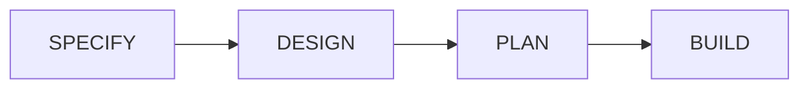
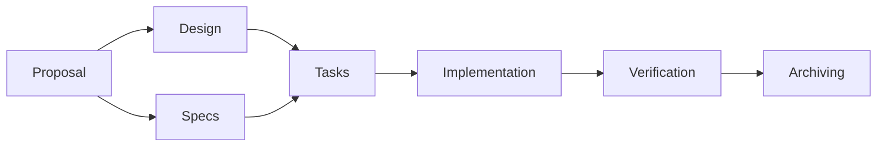

<h1 style="font-family: 'Silkscreen', 'Chakra Petch', sans-serif; font-size: 2.5em; letter-spacing: 5px; text-transform: uppercase; color: #fff;">OPENSPEC</h1>
<h3 style="font-family: 'VT323', monospace; letter-spacing: 2px; text-transform: uppercase;">A Lightweight Framework  for Spec-driven Development</h3>

Venkateswara VP
 
🅧 @reflexdemon

>>
## Agenda
* What is Spec-driven development (SDD)?
* How OpenSpec helps?
* Lets get started with OpenSpec
* Demo App Building
* Q&A

VV
## The "Vibe Coding" Reality

Note: How many of you vibe code?

VV

### Pitfalls
* **Inconsistency** <!-- .element: class="fragment" -->
    - Output varies wildly between prompts.
* **Lack of Maintainability** <!-- .element: class="fragment" -->
    - Logic is hidden in chat history.
* **Hidden Debt** <!-- .element: class="fragment" -->
    - "Black box" code generation leads to bugs.

VV
## Pipeline

>>
## SDD Levels

- **Spec-first**: Detailed specs are written before coding. <!-- .element: class="fragment" -->
- **Spec-anchored**: The spec is maintained as a reference throughout development. <!-- .element: class="fragment" -->
- **Spec-as-source**: The spec is the primary source of truth, updated rather than the code itself. <!-- .element: class="fragment" -->

VV
>>
## Key Aspects of AI-Driven Spec Development

 **Benefits** <!-- .element: class="fragment" -->
    - Predictable AI Behavior
    - Better architectural control
    - Reduced "vibe coding" errors

Note:
Workflow: The process moves from requirement formalization, planning, and design, to AI-driven generation, and finally, verification.
Benefits: It separates the "what" (spec) from the "how" (code), allowing for rapid iteration, better architectural control, and reduced "vibe coding" errors.

### What tools are available for SDD?

This approach treats specs as "executable contracts", using tools like
 - [Augment Code](https://www.augmentcode.com/)
 - [GitHub Spec Kit](https://github.com/features/copilot/spec-kit)-
 - [Cursor](https://cursor.sh/)
 - [Kiro](https://kiro.ai/)
 - [OpenSpec](https://github.com/reflexdemon/openspec)
 
Note: Automate implementation, testing, and validation, thereby reducing ambiguity and preventing architectural drift in AI-generated code

>>
## How OpenSpec Helps
- **Artifact-Driven** <!-- .element: class="fragment" -->
    * Proposals, Designs, Specs, Tasks.
- **Predictability** <!-- .element: class="fragment" -->
    * Structured workflow ensures high-quality output.
- **Context Awareness** <!-- .element: class="fragment" -->
    * Connects existing project context with new requirements.

VV
## The Artifact Chain

VV
## OpenSpec Workflow in Action

VV
### 3. Implementation & Verification
Agents execute tasks based on specs, and the CLI verifies the output.
>>

>>
## Developer's Delight

VV
## Benefits
- **Reduced Hallucinations**
    * Code matches the Spec exactly.
- **Test Generation**
    * Specs automatically drive Unit & Integration tests.

>>
## Call to Action
* **Start Small**:
    * Use OpenSpec for your next bug fix.
* **Focus on Intent**:
    * Spend more time on Specs, less on Vibe prompts.
* **Collaborate**:
    * Share specs with your team and your AI.

>>

## Q&A
### Thank You!
🅧 @reflexdemon
